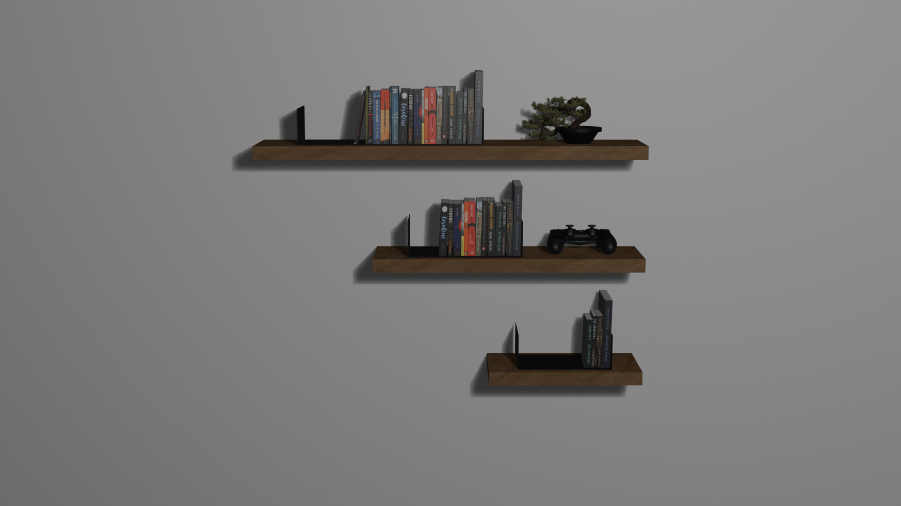

# Portfolio

This project aims to display my experiences, personal projects and some more things about me in a interactive way.

## 💡 Concept

The idea is to make a bookshelf or some sort of structure that holds some books or mangas and each book is a page.

-   The book will hover in the front and show its cape when the mouse passes over
-   Each book will contains at least two pages, one with an overview and another with a image
-   Each object in the scene will be focusable

## 🧠 Brainstorming Process

Initially it would be a simulation in a terminal. But in the end the idea didn't go through because the only outstanding thing was the terminal itself, with the final outcome a low resolution simulation.

The next idea involved simulating sand voxels to transition between pages, but it was too simple to make a whole project.

So, the final idea was a bookshelf as described at the [Concept](#concept) section.

## 🗽 Modeling

The [blender](https://blender.org) was used to model and some assets was downloaded from [BlenderKit](https://blenderkit.com) and [Sketchfab](https://sketchfab.com/).

## 📋 Credits

-   [Bonsai](https://www.blenderkit.com/asset-gallery-detail/e660c066-9036-41eb-bb8f-de21ac070970/)
-   [Placeholder Books](https://www.blenderkit.com/asset-gallery-detail/bbd0c484-b823-4c0b-bef6-3c1ad07b7f40/)
-   [DualShock 4](https://skfb.ly/oPRAI)
-   [Wood Material](https://www.blenderkit.com/get-blenderkit/752306e7-fb72-4a84-89a1-3be404dcdc38/)
