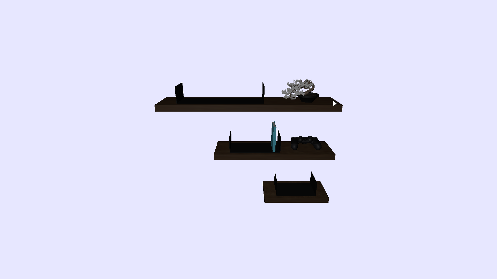

# Portfolio

This project aims to display my experiences, personal projects and some more things about me in a interactive way.



## 💡 Concept


The idea is to make a bookshelf or some sort of structure that holds some books or mangas and each book is a page.

-   The book will hover in the front and show its cape when the mouse passes over
-   Each book will contains at least two pages, one with an overview and another with a image
-   Each object in the scene will be focusable

## 🌲 Project Structure

```bash
portfolio/
├── front
│   ├── angular.json
│   ├── package.json
│   ├── package-lock.json
│   ├── public
│   │   ├── favicon.ico
│   │   └── models
│   │       ├── bonsai.glb
│   │       ├── book.glb
│   │       ├── book_supports.glb
│   │       ├── dualshock.glb
│   │       └── planks.glb
│   ├── README.md
│   ├── src
│   │   ├── app
│   │   │   ├── app.config.server.ts
│   │   │   ├── app.config.ts
│   │   │   ├── app.html
│   │   │   ├── app.routes.server.ts
│   │   │   ├── app.routes.ts
│   │   │   ├── app.scss
│   │   │   ├── app.spec.ts
│   │   │   ├── app.ts
│   │   │   ├── models
│   │   │   │   ├── bonsai.ts
│   │   │   │   ├── book-supports.ts
│   │   │   │   ├── book.ts
│   │   │   │   ├── dualshock.ts
│   │   │   │   ├── loadable.ts
│   │   │   │   └── planks.ts
│   │   │   ├── pages
│   │   │   │   └── scene
│   │   │   │       ├── scene.html
│   │   │   │       ├── scene.scss
│   │   │   │       ├── scene.spec.ts
│   │   │   │       └── scene.ts
│   │   │   └── services
│   │   │       ├── logger.spec.ts
│   │   │       ├── logger.ts
│   │   │       ├── render.spec.ts
│   │   │       └── render.ts
│   │   ├── index.html
│   │   ├── main.server.ts
│   │   ├── main.ts
│   │   ├── server.ts
│   │   └── styles.scss
│   ├── tsconfig.app.json
│   ├── tsconfig.json
│   └── tsconfig.spec.json
└── README.md
```

## ⚙️ Technologies


## 🧠 Brainstorming Process

Initially it would be a simulation in a terminal. But in the end the idea didn't go through because the only outstanding thing was the terminal itself, with the final outcome a low resolution simulation.

The next idea involved simulating sand voxels to transition between pages, but it was too simple to make a whole project.

So, the final idea was a bookshelf as described at the [Concept](#concept) section.

## 🗽 Modeling

The [blender](https://blender.org) was used to model and some assets was downloaded from [BlenderKit](https://blenderkit.com) and [Sketchfab](https://sketchfab.com/).

## 📋 Credits

-   [Bonsai](https://www.blenderkit.com/asset-gallery-detail/e660c066-9036-41eb-bb8f-de21ac070970/)
-   [Placeholder Books](https://www.blenderkit.com/asset-gallery-detail/bbd0c484-b823-4c0b-bef6-3c1ad07b7f40/)
-   [DualShock 4](https://skfb.ly/oPRAI)
-   [Wood Material](https://www.blenderkit.com/get-blenderkit/752306e7-fb72-4a84-89a1-3be404dcdc38/)
-   [Paper Material](https://www.blenderkit.com/get-blenderkit/2168faea-3e64-42b6-89b3-d8d083805db2/)
